# 하루 한 가지, 0~60개월 발달 카드

**저자:** 전선혜, 김윤주
**프로젝트:** 2026 프로젝트

---

## 우리 아이 하루 기록

| 항목 | 단위 |
|---|---|
| **체중** | kg |
| **키** | cm |
| **머리 둘레** | cm |
| **수면 시간** | 시간 |
| **수유 횟수** | 회 |
| **배변 횟수** | 회 |
| **부모 메모** | |

하루에 한 번, 가능한 만큼만 기록해 주세요.
체중·키·머리둘레 같은 성장 수치와 수면·수유·배변 같은 생활 리듬을 **꾸준히 쌓으면,**
앱에서 **변화를 그래프**로 확인하며 우리 아이의 발달 흐름을 더 쉽게 이해할 수 있어요.

> 앱에서 누적 그래프로 성장 흐름을 확인하세요!

---

## 목차 (Contents)

### 제1장 0-1주 신체활동 루틴 | "신경이 안정되는 시간"

- 1-1. 이 시기 한눈에 보기!
- 1-2. 발달 포인트
- 1-3. 반사 체크
- 1-4. 부모 관찰 체크
- 1-5. 점수 해석 & 다음 단계

### 제2장 2-3주 신체활동 루틴 | "연결이 늘어나는 시간"

- 2-1. 이 시기 한눈에 보기!
- 2-2. 발달 포인트
- 2-3. 반사 체크
- 2-4. 부모 관찰 체크
- 2-5. 점수 해석 & 다음 단계

---

# 제1장 0-1주 신체활동 루틴

## "신경이 안정되는 시간"

---

### 1-1. 이 시기 한눈에 보기!

> 핵심 대신, 새로운장 자극보다는 "안전한 울타리"임을 알려주는 시기입니다

#### 0-1주, 아기는 어떤 시기일가요?

태어난 직후 0-1주는
아기가 처음으로 **자궁 밖 환경(빛·소리·온도)**에 적응하는 시기입니다.

이 시기에는 새로운 자극을 많이 주기보다,
아기가 안정적으로 '기본 리듬'을 만들어 가도록 돕는 것이 더 중요합니다.

이 시기의 핵심 목표는:

1. 호흡·심박·체온이 안정되는 것
2. 수유(먹기)와 잠(쉬기) 리듬을 찾아가는 것
3. 과한 자극 없이 편안함을 느끼는 경험을 반복하는 것
4. 보호자의 안아주기·목소리·눈맞춤 속에서 안정감을 경험하는 것

> 즉, "많이 자극해 주는 것"보다 "편안하게 해주는 것"이 우선입니다.

---

### 1-2. 발달 포인트

많은 부모님이 이렇게 생각해요.

> **"지금부터 뭐라도 많이 해줘야 발달이 빠르지 않을까?"**

하지만 **0-1주는 다릅니다.**

0-1주는 '근육을 키우는 시기'라기보다,
아기의 뇌와 신경이 '안정'을 배우는 시기예요.

아기의 뇌와 신경은 아직 매우 예민해서,
과한 자극은 오히려 다음과 같은 반응으로 이어질 수 있어요.

- 잠들기 어려움 / 잠이 얕아짐
- 갑작스러운 울음(칭얼거림) 증가
- 몸이 뻣뻣해지거나 긴장 증가
- 깜짝 반응(놀람) 증가
- 수유 리듬이 흐트러짐

#### 그래서 우리는 이렇게 진행합니다!

- **짧게** (1~3분)
- **부드럽게** (작은 자극)
- **반복적으로** (같은 방식으로)
- **관찰하면서** (아기 신호에 맞추기)

이 활동들은 아기에게 이렇게 말해주는 것과 같아요.

> "여기는 안전해"
> "나는 보호받고 있어."

이 안정감이 쌓이면,
이후 움직임과 감각 경험의 기초가 될 수 있습니다.

*신경계 통합 관점 추가*

---

#### 0-1주 발달 특징

**신체 발달**
- 출생 직후 0-1주는 **\*원시반사**가 자연스럽게 관찰될 수 있는 시기입니다.
- 전반적으로 **굴곡 자세(웅크린 자세)**가 자연스럽고, 팔다리 움직임은 아직 **의도적으로 조절되지 않습니다.**
- 갑작스러운 소리·빛·움직임에 **\*모로반사(깜짝 반응)**이 비교적 쉽게 나타납니다.
- 시력은 아직 선명하지 않지만, **약 20~30cm 거리가 가장 보기 편한 범위**입니다.
  - → 핵심 키워드: **"적응" · "안정" · "보호자와의 초기 연결"**

**정서 발달**
- 배고픔, 불편함, 졸림 등 기본 욕구는 주로 **울음으로 표현**합니다.
- 안아주기·포옹·피부 접촉 같은 안정 자극에 **진정되는 반응**이 나타날 수 있습니다.
- 부모의 **표정·목소리 톤**, 그리고 익숙한 **심장 소리/리듬**에 민감하게 반응합니다.
  - → 핵심 키워드: **"안전하다는 감각 형성"**

**사회·인지 발달**
- 20~30cm 거리에서 **보호자의 얼굴을 잠깐 응시**하는 모습이 나타날 수 있습니다.
- 보호자의 목소리에 잠시 멈추거나(울음이 줄거나) **조용해지는 반응**이 보이기도 합니다.
- 냄새·촉각 등 감각 자극에 민감하며, 밝고 어두운 대비(고대비 자극)에 반응이 나타날 수 있습니다.
  - → 핵심 키워드: **"연결 경험 쌓기"**

> \* 원시반사: 아기가 태어날 때부터 가지고 있는 "자동 반응"이에요.
> \* 모로반사: 갑작스러운 소리/움직임에 놀라 팔을 벌렸다가 모으는 "깜짝 반응"이에요.

---

### 1-3. 활동 패키지 — "하루 한 가지씩 실천해 보세요!"

#### 0-1주 안정 루틴

**"하루 한 가지씩, 짧게·부드럽게·반복적으로 실천해 보세요!"**

0-1주는새로운 기능을 많이 가르치기보다, **편안한 리듬**을 만들어 가는 시기입니다.
아기가 **호흡·체온·수유·수면** 같은 기본 기능을 안정적으로 적응해 가는 시기입니다.

그래서 이 시기의 신체활동은 운동량보다
**안정감(안전 신호)을 반복 경험하는 것이 핵심**이에요.

- 하루에 전부 하지 않아도 괜찮아요.
- 아기가 편안해질 때 1~2개만, 1-3분이면 충분합니다.
- 아기가 고개를 돌리거나 울음이 커지면 잠시 멈추고 쉬어 주세요.

**발달 포인트:** 적응과 안정
- 신경계 통합 관점 추가
- 단순 안정이 아니라, **"감각 과부하 방지"**를 위한 저자극 환경 조성 지침 추가.

**반사 체크:** 모로반사 등
- 반응성(Responsiveness) 측정
- 반사가 "있나 없나"를 넘어, **"자극 후 얼마나 빨리 진정되는가"**를 기록하는 칸 추가.

**활동 1:** 품-숨-멈춤 루틴
- 심박수 동기화 (Co-regulation)
- 보호자의 호흡에 아기가 동기화되는지 관찰하는 '5초 멈춤' 구간의 중요성 상세 설명.

**추천 교구:** 가제 손수건
- 고대비 시각 자극 활용
- Lovevery 스타일의 고대비(흑백) 패턴을 가제 수건 위에 배치하여 초점 맞추기 유도.

---

#### 활동 1. 품-숨-멈춤 루틴

- 활동 유형: 진정 안정 · 촉각 · 청각 통합 · 초기 상호작용 루틴
- 연결 반사: 모로반사(Moro), 탐색반사(Rooting) 간접 관찰

**이렇게 해보세요!**
권장 시간: 20~40초, 1~3회 반복

1. 아기를 보호자의 가슴 가까이에 밀착해 안는다.
2. 바로 말을 걸기보다, 먼저 5초 정도 조용히 앉은 채 보호자의 호흡 리듬만 느끼게 한다.
3. 그다음 아주 짧게 같은 문장을 말한다.
   예: "괜찮아, 여기 있어." / "엄마 여기 있어." / "편안하게 쉬자."
4. 말한 뒤 다시 3~5초 정도 조용히 멈춘다.
5. 아기의 표정과 몸 상태를 보고, 괜찮으면 1~2회 더 반복한다.

**관찰 포인트**
- 안겼을 때 팔, 다리, 어깨 힘이 조금 풀리는지
- 울음 강도나 찡그림이 줄어드는지
- 목소리가 들린 뒤 몸 움직임이나 얼굴 반응이 잠깐 달라지는지
- 안겼을 때 더 불편해하는지, 편안해하는지
- 정적인 순간도 조용히 견디는지, 자극을 요구하는지

**왜 이 활동을 하나요?**

0-1주의 신생아는 깨어 있는 시간이 매우 짧고, 외부 자극을 오래 처리하기 어렵다. 이 시기에는 새로운 기능을 많이 가르치보다, 보호자의 품과 목소리 속에서 **예측 가능한 안정 루틴을 경험**하는 것이 더 중요하다.
이 활동은 단아주는 촉감, 보호자의 숨결, 짧은 목소리, 그리고 잠깐의 정적을 하나의 흐름으로 묶어 아기에게 "익숙하고 편안한 패턴"을 만들어 주기 위한 활동이다. 특히 갑작스러운 자극이 아니라 **짧고 반복 가능한 안전 경험**을 제공하는 데 의미가 있다.

**기대 효과**
- 보호자 품 안에서 안정감을 경험하는 데 도움이 될 수 있다.
- 깨어 있는 아주 짧은 시간에 무리 없는 상호작용 루틴을 만들 수 있다.
- 수유 전후, 잠들기 전후에 차분한 전환 루틴으로 활용하기 좋다.
- 아기의 놀람 반응이나 긴장 상태를 부드럽게 관찰하는 기회가 된다.
- 보호자도 "무엇을 해야 하지?"보다 "같은 방식으로 반복하면 된다"는 자신감을 가질 수 있다.

**주의**
- 아기가 몸을 뒤로 젖히거나 울음이 더 커지면 바로 멈춘다.
- 배고프거나 기저귀가 불편한 상태에서는 활동보다 기본 욕구 해결이 먼저다.
- 흔들거나 세게 토닥이지 않는다.
- 말을 너무 길게 하거나 여러 문장을 계속 바꾸지 않는다.
- 졸린 신호가 강하면 활동보다 바로 쉬게 해주는 것이 우선이다.

**활용 TIP**
- 수유 직후 바로 하기보다, 트림 후 차분한 순간에 짧게 해보는 것이 좋다.
- 보호자마다 문장을 바꾸지 말고, 한동안 같은 문장을 반복하면 더 예측 가능한 루틴이 된다.
- 엄마, 아빠, 조부모가 각각 같은 방식으로 하면 아기가 더 안정적으로 익힐 수 있다.
- 밤 시간에는 목소리를 더 낮고 짧게, 낮 시간에는 조금 또렷하게 사용해도 좋다.

**필요 교구 / 준비물**
- **특별한 교구 없음**
- **보호자의 편안한 자세**
- **트림 후 사용할 얇은 가제수건 또는 어깨받이 천**

**대체 / DIY**
- 쿠션이나 수유쿠션을 사용해 보호자 팔의 긴장을 줄일 수 있다.
- 보호자의 얇은 면티, 부드러운 속싸개 정도면 충분하다.
- 별도 진정용 장난감 없이도 보호자의 목소리와 품 자체가 준비물이 된다.

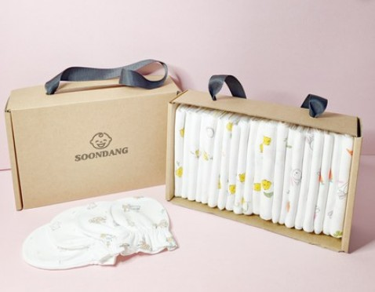

**사용 TIP**
- 활동 전 보호자 어깨와 팔 힘을 먼저 빼는 것이 중요하다.
- "말하기"보다 "멈춤"의 구간이 오히려 더 중요할 수 있다.
- 매번 길게 하지 말고, 성공했을 때 짧게 끝내는 것이 좋다.

> 추천 교구: 신생아 가제손수건

---

#### 활동 2. 얼굴-빛-목소리 삼각놀이

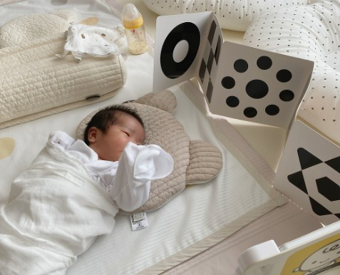

- 활동 유형: 시각-청각 통합 · 초기 얼굴 주의 경험 · 짧은 감각 전환 놀이
- 연결 반사: 탐색반사(Rooting), 시각적 주의 반응(반사보다는 관찰 중심)

**이렇게 해보세요!**
권장 시간: 15~30초, 1~2세트

1. 아기가 조용히 깨어 있는 순간, 얼굴을 20~30cm 거리에서 보여준다.
2. 보호자 얼굴 옆에 흰 천이나 밝은 톤 손수건을 잠깐 보여준다.
3. 천을 치우고 다시 보호자 얼굴만 보여준다.
4. 아주 짧게 이름을 부르거나 같은 말을 한다.
   예: "윤주야, 여기 봐." / "엄마 얼굴이야."
5. 반응을 보고 바로 마무리하거나 한 번 더 반복한다.

**관찰 포인트**
- 얼굴 쪽으로 잠깐이라도 시선이 머무는지
- 밝은 천과 얼굴 사이에서 시선 반응 차이가 있는지
- 목소리 뒤에 입, 눈, 손, 몸 움직임이 달라지는지
- 시선이 금방 흐트러지는지, 잠깐 유지되는지
- 너무 오래 못 봤다면 어느 자극 반응이 있는지

**왜 이 활동을 하나요?**

신생아는 아직 선명한 시각 추적을 오래 하거나 이렇지만, 가까운 거리의 얼굴, 밝기 대비, 익숙한 목소리에는 짧게 반응할 수 있다. 이 활동은 단순히 얼굴만 보여주는 것이 아니라, 보호자 얼굴과 밝은 대비 자극, 짧은 목소리를 차례로 제시해 아기가 짧은 시간 동안 감각을 정리해서 받아들이는 경험을 하도록 돕기 위한 것이다.
이 시기에는 오래 보게 만드는 것이 목표가 아니라, 잠깐이라도 시선이 머무르고 감각 전환이 부드럽게 일어나는지를 보는 것이 중요하다.

**기대 효과**
- 가까운 거리의 얼굴과 목소리에 익숙해지는 경험이 될 수 있다.
- 단조로운 자극보다 구조화된 짧은 시각-청각 놀이가 가능하다.
- 보호자가 아기의 시선 머무름, 반응 시작점, 피로 신호를 더 잘 알게 된다.
- "많이 보여주기"보다 "짧고 명확하게 보여주기"의 리듬을 만들 수 있다.

**주의**
- 형광등이 너무 밝거나 주변 배경이 복잡하면 집중이 어려울 수 있다.
- 얼굴을 너무 가까이 대거나 빠르게 움직이지 않는다.
- 아기가 하품, 얼굴 돌리기, 찡그림, 시선 회피를 보이면 바로 종료한다.
- 검정/흰색 카드처럼 대비가 아주 강한 자료를 오래 들이밀 필요는 없다.
- 이 활동을 시각 훈련처럼 오래 이어가면 오히려 과자극이 될 수 있다.

**활용 TIP**
- 기저귀 갈기 후 잠깐 깨어 있을 때 활용하기 좋다.
- 아침 시간엔 자연광 옆에서, 밤에는 조명을 낮춘 상태에서 아주 짧게 진행한다.
- 매번 교구를 바꾸지 말고 같은 흰 천이나 손수건을 쓰는 편이 더 안정적이다.
- 목소리도 같은 억양과 문장으로 반복하면 좋다.

**필요 교구 / 준비물**
- **흰색 또는 밝은 색 가제수건, 손수건, 작은 천 1장**
- **보호자 얼굴** *(고대비 시각자극 활용: 고대비(흑백) 패턴을 가제 수건 위에 배치하여 초점 맞추기 유도)*
- **조용한 환경**

**대체 / DIY**
- 흰 손수건, 흰 양말, 흰 면천 등 집에 있는 천으로 충분하다.
- 별도 흑백카드가 없어도 보호자 얼굴과 밝은 천만으로 가능하다.
- 수유 천이나 속싸개 일부를 접어서 사용해도 된다.

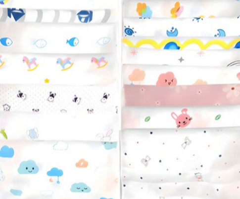

**사용 TIP**
- "오래 보게 해야 한다"보다 "잠깐 반응하면 성공"으로 생각하는 것이 좋다.
- 반응이 잘 오는 방향이 있으면, 그 방향을 먼저 제시해도 괜찮다.
- 사진보다 실제 얼굴이 더 중요하다.

> 추천 교구: 신생아 가제손수건

---

#### 활동 3. 둥글게-열고-다시 둥글게

- 활동 유형: 신체 안정 · 자세 경험 · 미세 움직임 조절 루틴
- 연결 반사: 모로반사(Moro), 파악반사(Palmar) 간접 관찰

**이렇게 해보세요!**
권장 시간: 20~30초, 2~3회

1. 아기를 눕히거나 안은 상태에서 팔과 다리를 몸 가까이 아주 부드럽게 모아준다.
2. 2~3초 정도 유지한다.
3. 그다음 힘을 조금 풀어 팔과 다리가 자연스럽게 살짝 열리게 둔다.
4. 다시 팔과 다리를 몸 가까이 모아준다.
5. 2~3회 반복 후 종료한다.

**관찰 포인트**
- 자세가 살짝 열릴 때 깜짝 반응이 큰지 작은지
- 다시 모아졌을 때 몸이 더 편안해지는지
- 손을 꽉 쥐는지, 서서히 푸는지
- 어깨가 들썩이거나 팔이 갑자기 벌어지는지
- 다리 긴장이 줄어드는지

**왜 이 활동을 하나요?**

신생아는 자궁 안에서 익숙했던 **둥근 굴곡 자세**에 가까울 때 더 편안함을 느끼는 경우가 많다. 하지만 실제 일상에서는 안겨 있을 때도, 눕혀질 때도, 기저귀를 갈 때도 몸이 잠깐씩 열리고 다시 모아지는 경험을 하게 된다.
이 활동은 몸을 단순히 꼭 안아주는 것에서 더 나아가, 아주 작은 범위에서 모아주기-살짝 풀기-다시 모아주기의 순서를 경험하게 하여 아기가 변화 속에서도 편안함을 유지하는지를 관찰하기 위한 활동이다.

**기대 효과**
- 몸이 모이는 자세에서 편안함을 느끼는지 관찰할 수 있다.
- 움직임 변화 전후의 긴장 차이를 보기 좋다.
- 기저귀 갈기, 옷 갈아입기 전후에도 응용 가능한 안정 루틴이 된다.
- 갑작스러운 열림보다 예측 가능한 작은 자세 변화를 경험하게 할 수 있다.

**주의**
- 팔과 다리를 억지로 누르지 않는다.
- 관절을 꺾거나 힘으로 자세를 만들지 않는다.
- 깜짝 놀람이 크면 반복하지 말고 그 자리에서 멈춘다.
- 아기가 뻣뻣하게 버티거나 울면 바로 종료한다.
- "자세 교정"처럼 접근하지 않는다.

**활용 TIP**
- 기저귀를 갈기 전 짧게 해주면 몸을 덜 뻣뻣하게 느낄 수 있다.
- 속싸개를 완전히 풀기 전후의 전환 루틴으로 사용해도 좋다.
- 밤 시간엔 더 작고 천천히, 낮 시간엔 깨어 있는 순간 아주 짧게 진행한다.

**필요 교구 / 준비물**
- **푹신하지 않은 평평한 바닥 또는 보호자 무릎**
- **얇은 속싸개 또는 부드러운 담요**
- **보호자의 따뜻한 손**

**대체 / DIY**
- 별도 교구 없이 가능
- 속싸개를 반쯤 덮은 상태로 진행해도 안정적이다.
- 수건을 말아 몸 옆에 두어 너무 많이 벌어지지 않게 보조할 수 있다.

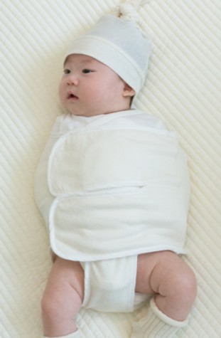

**사용 TIP**
- 힘을 주는 활동이 아니라 "받쳐주고 기다리는 활동"으로 이해해야 한다.
- 자세를 연 뒤 바로 다시 모아주는 흐름이 중요하다.
- 기분이 좋을 때보다 약간 예민할 때 더 반응 차이가 잘 보일 수 있다.

> 추천 교구: 신생아 속싸개

---

#### 활동 4. 손바닥 지도 읽기

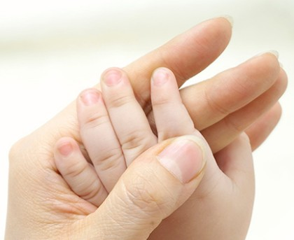

- 활동 유형: 촉각 탐색 · 말초 감각 경험 · 손 반응 관찰 활동
- 연결 반사: 파악반사(Palmar)

**이렇게 해보세요!**
권장 시간: 한 손당 10~15초

1. 아기의 손바닥 가운데를 손가락이나 엄지로 아주 부드럽게 감싼다.
2. 엄지손가락 쪽으로 짧게 이동해 살짝 눌러본다.
3. 다시 손바닥 가운데로 돌아온 뒤, 새끼손가락 쪽으로 이동한다.
4. 마지막으로 손등을 한 번 쓸어주고 전체 손을 감싸 마무리한다.
5. 반대 손도 같은 방식으로 진행한다.

**관찰 포인트**
- 손을 더 꽉 쥐는지, 약간 푸는지
- 손가락이 안쪽으로 모이는지 펴지는지
- 손 만진 뒤 얼굴 표정이 편안해지는지
- 좌우 손 반응 차이가 있는지
- 손 만진 후 팔 전체 긴장이 달라지는지

**왜 이 활동을 하나요?**

신생아의 손은 자주 쥐어져 있고, 작은 촉감에도 반응이 크게 나타날 수 있다. 이 활동은 손 전체를 마구 만지는 대신, 손바닥 중심-엄지 쪽-새끼손가락 쪽-손등으로 이어지는 **짧은 촉각 경로**를 만들어 손의 긴장과 반응을 부드럽게 관찰하기 위한 활동이다.
단순 쓰다듬기보다 순서가 있는 감각 경험을 제공하면, 보호자도 아기의 손 반응을 더 세밀하게 읽을 수 있다.

**기대 효과**
- 손 촉감에 대한 반응을 부드럽게 관찰할 수 있다.
- 파악반사나 손 긴장 정도를 일상적으로 살피는 데 도움이 된다.
- 보호자가 아기의 작은 반응을 더 섬세하게 읽는 계기가 된다.
- 목욕 후, 수유 후, 깨어 있는 짧은 시간에 부담 없이 활용 가능하다.

**주의**
- 손가락을 억지로 펴지 않는다.
- 간지럽히듯 빠르게 건드리지 않는다.
- 손이 차갑거나 아기가 몸 전체로 불편해하면 중단한다.
- 손톱이나 액세서리로 피부를 자극하지 않도록 한다.
- 손에 상처, 태열, 진물, 자극이 있으면 해당 부위는 피한다.

**활용 TIP**
- 목욕 후 손이 따뜻할 때 하면 반응이 더 부드럽게 보일 수 있다.
- 한쪽 손만 특별히 더 예민한지 관찰하기 좋다.
- 낮에는 손을 보고, 밤에는 손보다 전체 안정 여부만 살펴도 충분하다.

**필요 교구 / 준비물**
- **특별한 교구 없음**
- **보호자의 깨끗한 손**
- **필요 시 얇은 가제수건**

**대체 / DIY**
- 별도 촉감 교구 없이 가능
- 손바닥 대신 발바닥 버전으로 짧게 변형 가능
- 면수건을 손등 위에 잠깐 올려 촉감 변화를 줄 수도 있다.

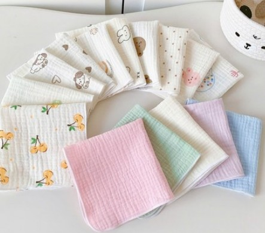

**사용 TIP**
- 가장 중요한 것은 압력이 아니라 순서다.
- 한 번 반응이 좋았던 경로를 같은 방식으로 반복하면 안정 루틴이 된다.
- 손을 펴게 만드는 것이 목표가 아니다.

> 추천 교구: 신생아 가제손수건

---

#### 활동 5. 배-다리-쉼표 연결놀이

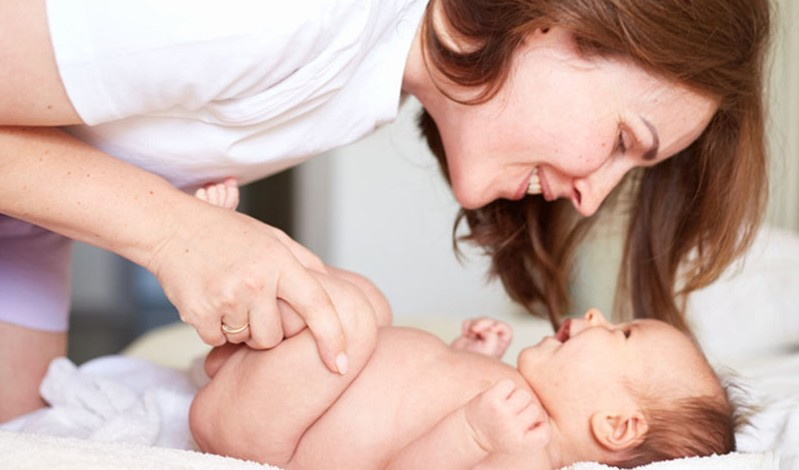

- 활동 유형: 신체 이완 · 복부 편안함 지원 · 움직임 전환 루틴
- 연결 반사: 파악반사(Palmar), 모로반사(Moro) 간접 관찰, 하지 반응 관찰

**이렇게 해보세요!**
권장 시간: 20~30초, 2~3회

1. 아기의 배 위에 손을 가볍게 올리고 2초 정도 멈춘다.
2. 두 다리를 아주 작게 접었다가 펴준다.
3. 다시 배 위에 손을 올리고 2초 정도 멈춘다.
4. 다리를 한 번 더 아주 작게 움직인다.
5. 아기의 표정과 배 긴장을 보고 마무리한다.

**관찰 포인트**
- 배를 만졌을 때 단단한지, 부드러운지
- 다리 움직임 전후 표정이 달라지는지
- 다리를 접을 때 싫어하는지, 괜찮아하는지
- 몸 말기, 찡그림, 가스 배출 전후 차이가 있는지
- 배 위에 손을 올렸을 때 진정되는지

**왜 이 활동을 하나요?**

0-1주의 아기는 수유, 트림, 배 불편감, 몸 맡기 같은 불편에 민감하게 반응할 수 있다. 이 활동은 단순히 다리를 움직이는 것에 그치지 않고, 배 위에 손 얹기-다리 움직임-잠깐 멈춤의 순서를 반복하여 움직임 전후의 긴장 변화를 살펴보기 위한 활동이다.
즉, "운동"보다는 **배와 다리의 연결 상태를 부드럽게 느끼고, 전후 차이를 관찰하는 루틴**에 가깝다.

**기대 효과**
- 배가 불편한 아기에게 짧은 이완 경험이 될 수 있다.
- 수유 후 예민한 시간대에 몸 상태를 살피기 좋다.
- 단순 다리 운동보다 "움직임 전후의 안정"을 함께 관찰할 수 있다.
- 보호자가 복부 긴장과 다리 움직임의 관계를 이해하는 데 도움이 된다.

**주의**
- 수유 직후 바로 하지 않는다.
- 다리를 크게 들거나 세게 누르지 않는다.
- 배가 지나치게 단단하거나 아기가 심하게 울면 활동보다 상태 확인이 우선이다.
- 배꼽 부위가 민감하면 해당 부위를 직접 누르지 않는다.
- 변비 치료, 가스 해결을 보장하는 활동처럼 설명하지 않는다.

**활용 TIP**
- 트림 후 조금 지나 안정된 순간에 시도하면 좋다.
- 기저귀 갈기 전에 짧게 해볼 수 있다.
- 다리 움직임보다 "배에 손을 얹고 멈추는 구간"에서 더 안정되는 아기도 많다.

**필요 교구 / 준비물**
- **평평한 바닥 또는 기저귀 갈이 매트**
- **얇은 방수패드 또는 면수건**
- **따뜻한 손**

**대체 / DIY**
- 별도 교구 없이 가능
- 방수패드 위에 면손수건을 한 겹 덮어 촉감을 부드럽게 할 수 있다.
- 다리 두 개 대신 한쪽씩 번갈아 접어보는 방식으로도 가능하다.

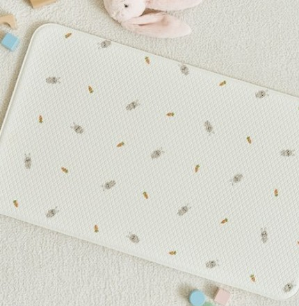

**사용 TIP**
- 동작보다 멈춤과 관찰이 더 중요하다.
- 매번 효과를 기대하기보다, 어떤 날에 더 편안해하는지 기록하는 것이 좋다.
- 아기가 싫어하면 바로 끝내는 것이 오히려 좋은 마무리다.

> 추천 교구: 신생아 기저귀 갈이매트

---

### 부록 1. 0-1주 활동 후 자연 반응 관찰표

#### 1. 이 관찰표는 어떻게 보나요?

이 표는 반사를 유도하거나 검사하기 위한 표가 아닙니다.
0-1주 아기와 짧은 활동을 한 뒤, 아기가 더 편안해졌는지, 불편해졌는지, 그리고 함께 보일 수 있는 **자연스러운 반응**을 차분히 기록하기 위한 관찰표입니다.

0-1주는 많은 것을 확인하는 시기가 아니라,
**짧고 부드러운 활동 후 아기의 상태 변화를 보는 시기**입니다.
따라서 이 표도 "잘했는지/못했는지"를 평가하는 용도가 아니라,
**오늘 아기에게 어떤 방식이 편안했는지 알기 위한 기록 도구**로 사용합니다.

**이렇게 활용하세요.**

- 활동 직후 1분 안에 아주 짧게 기록합니다.
- 먼저 전체 상태를 보고,
- 그다음 함께 보일 수 있는 자연 반응을 확인합니다.
- 하루에 모든 활동을 다 기록할 필요는 없습니다.
- 그날 했던 활동 중 1~2개만 기록해도 충분합니다.

---

#### 2. 먼저, 오늘 어떤 활동을 했나요?

**오늘 진행한 활동**

- □ 활동 1. 품-숨-멈춤 루틴
- □ 활동 2. 얼굴-빛-목소리 삼각놀이
- □ 활동 3. 둥글게-열고-다시 둥글게
- □ 활동 4. 손바닥 지도 읽기
- □ 활동 5. 배-다리-쉼표 연결놀이

**기록 날짜**

날짜: ________
시간: ________
활동 전 상태: □ 잠들기 전 □ 수유 후 □ 기저귀 교체 후 □ 깨어 있는 조용한 시간 □ 기타 ________

---

#### 3. 1단계: 활동 직후 아기의 전체 상태를 먼저 봅니다.

**0-1주 활동 직후 전체 상태 관찰표**

| 관찰 항목 | 예 | 보통 | 아니오 |
|---|---|---|---|
| 활동 후 몸이 조금 더 편안해 보였어요. | □ | □ | □ |
| 울음이나 찡그림이 줄어들었어요. | □ | □ | □ |
| 팔·다리·어깨의 긴장이 조금 풀린 것 같아요. | □ | □ | □ |
| 얼굴을 돌리거나 피하려는 신호가 보였어요. | □ | □ | □ |
| 활동 후 너무 피곤해 보였어요. | □ | □ | □ |
| 안았을 때 또는 손을 얹었을 때 차분해지는 모습이 있었어요. | □ | □ | □ |
| 활동 중보다 활동 후가 더 안정적으로 느껴졌어요. | □ | □ | □ |

**1단계 기록 시 보는 기준**
- **예:** 비교적 분명하게 보였을 때
- **보통:** 잘 모르겠거나 잠깐 보였을 때
- **아니오:** 거의 보이지 않았을 때

**1단계 해석 도움말**
- "편안해 보였어요", "차분해졌어요"에 예가 많으면
  → 오늘 활동이 비교적 무리 없었을 가능성이 있습니다.
- "피하려는 신호", "너무 피곤해 보였어요"에 예가 많으면
  → 다음에는 시간을 더 줄이거나, 활동 수를 줄이는 것이 좋습니다.

---

#### 4. 2단계: 함께 볼 수 있는 자연 반응을 확인합니다.

아래 항목은 활동 후 함께 볼 수 있는 반응을 정리한 것입니다.
전문 용어보다 보이는 모습을 먼저 보고 체크하세요.

> 반응상 주의: 반사가 "있나 없나"를 넘어, "자극 후 얼마나 빨리 진정되는가"를 기록하는 칸 추가.

**0-1주 자연 반응 관찰표**

| 보이는 모습(부모가 보는 표현) | 관련 반사/반응 | 뚜렷함 | 약하게 보임 | 잘 안보임 |
|---|---|---|---|---|
| 깜짝 놀라며 팔이 벌어지는 모습이 있었어요. | 모로반사(Moro) | □ | □ | □ |
| 입 주변 자극에 얼굴이나 입이 반응했어요. | 탐색반사(Rooting) | □ | □ | □ |
| 빠는 율직임이 보였어요. | 빨기반사(Sucking) | □ | □ | □ |
| 손바닥 자극에 손을 쥐는 모습이 있었어요. | 파악반사(Palmar) | □ | □ | □ |
| 얼굴이나 밝은 물체 쪽으로 시선이 잠깐 머물렀어요. | 시각적 주의 반응 | □ | □ | □ |
| 목소리 뒤에 표정, 입, 몸 움직임이 잠깐 달라졌어요. | 청각-사회적 반응 | □ | □ | □ |
| 안기거나 자세를 바꾼 뒤 몸이 조금 더 안정되는 모습이 있었어요. | 굴곡 자세 반응 / 신체 안정 반응 | □ | □ | □ |
| 배나 다리를 만졌을 때 몸 전체 긴장 변화가 있었어요. | 신체 긴장 변화 관찰 | □ | □ | □ |

**2단계 체크 기준**
- **뚜렷함:** 비교적 분명하게 관찰됨
- **약하게 보임:** 약하거나 짧게 보임
- **잘 안 보임:** 오늘은 거의 보이지 않음

**2단계 사용할 때 중요한 점**
- "잘 안 보임"은 곧바로 문제를 뜻하지 않습니다.
- 0-1주 아기는 수면, 수유, 피로도에 따라 반응 차이가 큽니다.
- 한 번의 기록보다 **며칠의 흐름**을 보는 것이 더 중요합니다.

---

#### 5. 오늘 기록 메모

오늘 가장 편안해한 활동

________________________________________

오늘 조금 부담스러워한 활동

________________________________________

활동 후 특히 눈에 띄었던 반응

________________________________________

**다음에는 어떻게 조정하면 좋을까요?**

- □ 시간을 더 짧게 해본다
- □ 활동 횟수를 줄여본다
- □ 더 조용한 시간에 해본다
- □ 수유/잠 루틴과 연결해본다
- □ 같은 활동을 한 번 더 관찰해본다
- □ 기타: ________________

---

#### 6. 간단 해석 가이드

**이런 경우는 비교적 무리 없는 흐름일 수 있어요**
- 활동 후 몸이 더 편안해 보임
- 울음이나 찡그림이 줄어듦
- 안겼을 때 안정되는 모습이 있음
- 반응이 뚜렷하지 않아도 전반적으로 편안해 보임

**이런 경우는 다음에 더 짧게 조정해보세요**
- 얼굴을 돌리거나 자꾸 피함
- 활동 후 더 예민해짐
- 몸이 뻣뻣해지거나 울음이 커짐
- 한 활동 뒤 너무 피곤해 보임

**이런 경우는 며칠 기록을 이어서 보세요**
- 어떤 날은 편안하고 어떤 날은 예민함
- 한쪽 손/몸만 반응 차이가 있음
- 수유 전후에 반응 차이가 큼

**이런 경우는 상담을 고려해 보세요**
- 며칠 동안 반복해서 전반 반응이 매우 약함
- 안아도 진정이 거의 되지 않는 상태가 계속됨
- 수유, 잠, 울음 회복이 유난히 어렵고 지속됨
- 보호자가 "평소와 다르게 이상하다"고 계속 느끼는 변화가 있음

---

### 1-4. 부모 관찰 기록용 체크리스트

#### 0-1주에서 봐야 할 6개 체크 영역부터 알고가기!

**① 신체·성장**
몸의 기본 자세/근긴장, 전반적인 활력, 성장·체중 변화 흐름을 봅니다.

**② 감각·지각**
빛·소리·촉감 같은 자극에 "너무 과하지 않게/너무 약하지 않게"반응하는지 확인합니다.

**③ 인지·주의**
짧은 순간이라도 얼굴/빛에 주의가 머무르는지, 자극에 대한 조절(안정)이 되는지 봅니다.

**④ 언어·의사소통**
울음으로 욕구를 표현하고, 보호자 목소리에 반응하는 초기 소통 신호를 봅니다.

**⑤ 정서·사회**
안아주기/접촉에 진정되는지, 표정이 부드러워지는지 등 '안정감' 신호를 봅니다.

**⑥ 조절·수면·생리**
잠·깨기 전환, 수유 후 진정, 호흡·피부색 같은 기본 생리 안정 신호를 확인합니다.

---

#### 점수 기준

| 점수 | 기준 |
|---|---|
| 4 | 하루 동안 자주 안정적으로 보였다 |
| 3 | 하루 동안 여러 번 보였다 |
| 2 | 가끔 보였다 |
| 1 | 드물게 보였다 |
| 0 | 오늘은 거의 보이지 않았다 |

> 관찰 기준: "지난 24시간(또는 오늘 하루) 동안 '대표적으로 보인 빈도"

> 기록 TIP: "아기가 잠든 상태를 제외하고, 깨어있는 짧은 시간(기저귀/수유 전후)을 중심으로 관찰"

---

#### ① 신체·성장

| 관찰 항목 | 4 | 3 | 2 | 1 | 0 | 메모 |
|---|---|---|---|---|---|---|
| Q1-1. 가만히 있을 때 팔과 다리가 몸 쪽으로 자연스럽게 모여 있는 편이다. | □ | □ | □ | □ | □ | |
| Q1-2. 안거나 눕혀 놓았을 때 몸이 지나치게 축 늘어지지만은 않는다. | □ | □ | □ | □ | □ | |
| Q1-3. 몸이나 머리가 한쪽으로만 계속 심하게 치우치지는 않는다. | □ | □ | □ | □ | □ | |

#### ② 감각·지각

| 관찰 항목 | 4 | 3 | 2 | 1 | 0 | 메모 |
|---|---|---|---|---|---|---|
| Q2-1. 20~30cm 거리에서 보호자 얼굴 쪽을 잠깐이라도 바라보는 순간이 있다. | □ | □ | □ | □ | □ | |
| Q2-2. 갑작스러운 소리(문 닫힘, 박수 등)에 잠깐 멈추거나 몸이 움찔하는 반응이 있다. | □ | □ | □ | □ | □ | |
| Q2-3. 밝은 빛이나 얼굴·밝은 물체를 보여주면 눈 깜빡임이나 시선 변화가 잠깐 나타난다. | □ | □ | □ | □ | □ | |

#### ③ 인지·주의

| 관찰 항목 | 4 | 3 | 2 | 1 | 0 | 메모 |
|---|---|---|---|---|---|---|
| Q3-1. 얼굴이나 빛 쪽을 1~2초라도 바라보는 순간이 있다. | □ | □ | □ | □ | □ | |
| Q3-2. 비슷한 소리나 접촉이 반복될 때, 처음보다 덜 놀라거나 안아주면 다시 가라앉는 모습이 있다. | □ | □ | □ | □ | □ | |
| Q3-3. 깨어 있는 짧은 시간에 팔이나 다리를 스스로 움직이는 모습이 보인다. | □ | □ | □ | □ | □ | |

#### ④ 언어·의사소통

| 관찰 항목 | 4 | 3 | 2 | 1 | 0 | 메모 |
|---|---|---|---|---|---|---|
| Q4-1. 보호자 목소리가 들리면 울음을 잠깐 멈추거나 표정·몸 반응이 달라진다. | □ | □ | □ | □ | □ | |
| Q4-2. 배고픔, 졸림, 불편할 때 울음이나 몸짓이 조금 다르게 느껴지는 순간이 있다. | □ | □ | □ | □ | □ | |
| Q4-3. 가까이에서 말을 걸면 표정, 몸 움직임, 호흡 리듬에 잠깐 변화가 나타난다. | □ | □ | □ | □ | □ | |

#### ⑤ 정서·사회

| 관찰 항목 | 4 | 3 | 2 | 1 | 0 | 메모 |
|---|---|---|---|---|---|---|
| Q5-1. 안아주기나 피부 접촉을 하면 몸이 이완되거나 진정되는 모습이 있다. | □ | □ | □ | □ | □ | |
| Q5-2. 안아준 뒤 울음이 조금 줄어들거나 진정되는 시간이 있다. | □ | □ | □ | □ | □ | |
| Q5-3. 눈을 마주치거나 얼굴을 가까이 보여줄 때 표정이 잠깐 부드러워지는 순간이 있다. | □ | □ | □ | □ | □ | |

#### ⑥ 조절·수면·생리

| 관찰 항목 | 4 | 3 | 2 | 1 | 0 | 메모 |
|---|---|---|---|---|---|---|
| Q6-1. 잠에서 깨어날 때 바로 울기만 하기보다, 잠깐 눈을 뜨거나 몸을 움직이며 깨어나는 흐름이 보인다. | □ | □ | □ | □ | □ | |
| Q6-2. 수유 후 안아주거나 트림을 하면 비교적 빠르게 진정되거나 잠드는 편이다. | □ | □ | □ | □ | □ | |
| Q6-3. 울음 뒤에 안아주거나 돌봐주면 다시 가라앉는 순간이 있다. | □ | □ | □ | □ | □ | |

---

#### 점수 해석 가이드

**퍼센트 = (획득 점수 / 72) x 100** → 오늘 관찰 기록을 이해하기 위한 참고값입니다.

| 퍼센트 | 해석 | 부모 솔루션 |
|---|---|---|
| 85~100% | 매우 안정적 반응 | 기본 루틴 유지 / 과한 자극 피하기. 하루 1~2회 짧은 활동만 하고, 수유-트림-안정 터치-수면 흐름을 일정하게 반복합니다. |
| 70~84% | 대체로 안정적인 편 | 현재 루틴 유지 / 기록 지속. 저녁 예민 시간에는 새 활동보다 안기기·조용한 목소리·부드러운 터치 중심으로 갑니다. |
| 55~69% | 조금 더 관찰이 필요한 편 | 활동 수 줄이기 / 안정 우선. 하루 1개 활동만 짧게 하고, 수유·트림·기저귀·수면 리듬을 먼저 점검합니다. |
| 40~54% | 루틴 조정 및 재확인 권장 | 과자극 줄이기 / 진정 루틴 고정. 빛·소리·움직임을 줄이고, 안기기·밀착 자세·짧은 목소리 중심으로 2~3일 재관찰합니다. 추가 관찰 / 전문가 상담 고려. |
| 0~39% | 추가 관찰 및 상담 고려 | 기본 적응(먹기·잠·울음 회복·진정)이 반복적으로 어렵거나 보호자 걱정이 크면 빠르게 상담합니다. |

\* 본 관찰표는 표준화 검사가 아닌 부모 관찰 기록용 구조입니다.

> 점수 입력 후, 앱에서 결과와 영역별 요약을 확인하세요. 해당 구간의 부모 솔루션을 체크하며 오늘 루틴을 조정해 보세요.

---

#### 위험 신호 (추가 관찰 필요 / 전문가 상담 고려)

| 항목 | 체크 | 메모 |
|---|---|---|
| 전반 반응 저하: 시선·소리·촉감·움직임 반응이 갑자기 줄어듦 | □ | |
| 한쪽 치우침 지속: 몸이나 머리가 한쪽으로만 계속 기울거나 치우침 | □ | |
| 먹기/잠/울음 회복 어려움: 진정이 거의 되지 않음 | □ | |
| 호흡이 평소보다 힘들어 보이거나 불규칙함이 반복됨 | □ | |
| 입술/피부색이 평소와 다르게 창백하거나 퍼렇게 보임 | □ | |
| 보호자 직감: "뭔가 이상하다" 느낌이 강함 | □ | |

\* 권고 문구: 위 양상이 반복되거나 2~3일 이상 지속되거나, 보호자 걱정이 크면 전문가 상담/추가 관찰을 고려합니다.

---

### 부록 2. 각 문항 출처 도구 (비공개)

#### ① 신체·성장

Q1-1 가만히 있을 때 팔과 다리가 몸 쪽으로 자연스럽게 모여 있는 편이다.
참고 도구: NBAS, Bayley-4, AIMS

Q1-2 안거나 눕혀 놓았을 때 몸이 지나치게 축 늘어지지만은 않는다.
참고 도구: NBAS, Bayley-4, HNNE/NBAS 계열 신생아 신경행동 관찰 프레임

Q1-3 몸이나 머리가 한쪽으로만 계속 심하게 치우치지는 않는다.
참고 도구: NBAS, Bayley-4, K-DST

#### ② 감각·지각

Q2-1 20~30cm 거리에서 보호자 얼굴을 잠깐이라도 바라보는 순간이 있다.
참고 도구: NBAS(or NBO/NBAS), Bayley-4, ASQ-3

Q2-2 갑작스러운 소리에 잠깐 멈추거나 몸이 움찔하는 반응이 있다.
참고 도구: NBAS, Bayley-4, K-DST

Q2-3 밝은 빛이나 얼굴·밝은 물체를 보여주면 눈 깜빡임이나 시선 변화가 잠깐 나타난다.
참고 도구: NBAS, Bayley-4, ASQ-3

#### ③ 인지·주의

Q3-1 얼굴이나 빛 쪽을 1~2초라도 바라보는 순간이 있다.
참고 도구: NBAS, Bayley-4, ASQ-3

Q3-2 비슷한 소리나 접촉이 반복될 때, 처음보다 덜 놀라거나 안아주면 다시 가라앉는 모습이 있다.
참고 도구: NBAS, Bayley-4, 신생아 상태조절 프레임

Q3-3 깨어 있는 짧은 시간에 팔이나 다리를 스스로 움직이는 모습이 보인다.
참고 도구: NBAS, Bayley-4, AIMS

#### ④ 언어·의사소통

Q4-1 보호자 목소리가 들리면 울음을 잠깐 멈추거나 표정·몸 반응이 달라진다.
참고 도구: NBAS, ASQ-3, Bayley-4

Q4-2 배고픔, 졸림, 불편할 때 울음이나 몸짓이 조금 다르게 느껴지는 순간이 있다.
참고 도구: NBAS, Bayley-4, ASQ-3

Q4-3 가까이에서 말을 걸면 표정, 몸 움직임, 호흡 리듬에 잠깐 변화가 나타난다.
참고 도구: NBAS, Bayley-4, 부모-영아 상호작용 프레임

#### ⑤ 정서·사회

Q5-1 안아주기나 피부 접촉을 하면 몸이 이완되거나 진정되는 모습이 있다.
참고 도구: NBAS, Bayley-4, skin-to-skin & co-regulation 프레임

Q5-2 안아준 뒤 울음이 조금 줄어들거나 진정되는 시간이 있다.
참고 도구: NBAS, 부모-영아 공조절 프레임, ASQ:SE 계열 관점 참고

Q5-3 눈을 마주치거나 얼굴을 가까이 보여줄 때 표정이 잠깐 부드러워지는 순간이 있다.
참고 도구: NBAS, Bayley-4, ASQ-3 personal-social 영역 관점 참고

#### ⑥ 조절·수면·생리

Q6-1 잠에서 깨어날 때 바로 울기만 하기보다, 잠깐 눈을 뜨거나 몸을 움직이며 깨어나는 흐름이 보인다.
측정 도구: NBAS, Bayley-4, 부모 수면·상태전환 기록 프레임

Q6-2 수유 후 안아주거나 트림을 하면 비교적 빠르게 진정되거나 잠드는 편이다.
측정 도구: NBAS, Bayley-4, 부모 일상 루틴 관찰 프레임

Q6-3 울음 뒤 안아주거나 돌봐주면 다시 가라앉는 순간이 있다.
측정 도구: NBAS, 부모-영아 co-regulation 프레임, ASQ류 부모관찰 문항 구조 참고

---

#### 참고 도구 요약표

| 참고 도구 | 주로 참고한 부분 |
|---|---|
| NBAS | 굴곡 자세, 긴장도, 대칭성, orientation, 놀람 반응, consolability, 상태 조절, 자발 움직임, 사회적 반응 |
| NBO/NBAS 계열 프레임 | 신생아 행동관찰, 얼굴 보기, 조기 사회 반응, 자극 후 회복 흐름 |
| Bayley-4 | 운동·행동 관찰 틀, 주의·인지 반응 틀, 조기 언어·사회정서 반응 관찰 틀 |
| ASQ-3 | 부모보고형 문항 구조, 시각·사회·의사소통 영역의 관찰식 서술 방식 |
| ASQ:SE 계열 관점 | 진정, 정서조절, 사회적 안정 반응을 부모가 관찰하는 방식 |
| AIMS | 자세, 굴곡 posture, 자발 움직임, 조기 운동 관찰 관점 |
| K-DST | 부모 관찰 기반 선별 관점, 위험 신호/비대칭 관찰 관점 |
| HNNE/NBAS 계열 신경행동 관찰 프레임 | 축 늘어짐, 긴장도, 대칭성, 신생아 조기 신경행동 관찰 관점 |
| skin-to-skin / co-regulation 프레임 | 안아주기, 피부 접촉, 진정, 이완, 보호자-영아 공조절 |
| 부모-영아 상호작용 프레임 | 목소리, 표정, 움직임, 호흡 변화 같은 조기 상호작용 반응 |
| 부모 수면·상태전환 기록 프레임 | 잠-깸 전환, 졸림 호흡, 깨어나는 패턴 |
| 부모 일상 루틴 관찰 프레임 | 수유 후 진정, 트림 후 안정, 울음 뒤 회복 같은 일상 관찰 흐름 |

---

# 제2장 2-3주 신체활동 루틴

## "연결이 늘어나는 시간"

---

### 2-1. 이 시기 한눈에 보기!

#### 2-3주, 아기는 어떤 시기일가요?

2-3주는 아기가 "세상에 적응"을 계속하면서도,
조금씩 깨어 있는 시간이 늘고(\*각성 증가), 먹고 자는 리듬이 정리되기 시작하는 시기입니다.

이 시기의 핵심 목표는:

1. 수유·수면 리듬이 조금 더 안정되는 것(먹는 리듬/트림/소화 적응)
2. 깨어 있는 동안의 '안정(진정) 회복'이 빨라지는 것
3. 부모와의 연결(목소리·얼굴·접촉)에 반응이 늘어나는 것
4. 과한 자극 없이 편안함을 반복 경험하는 것

> 즉, 0-1주처럼 "안정이 최우선"인건 그대로지만,
> 이제는 깨어 있는 시간이 늘기 때문에 **짧은 활동을 '조금 더 자주' 넣을 수 있는 시기**입니다.

- 참고: 2-3주에도 빨기·탐색·모로·파악 같은 생존 반사는 계속 나타납니다.
  우리는 반사를 '훈련'하기보다, 활동 후에도 **아기가 더 편안해졌는지**를 먼저 확인합니다.

> \* 각성: 잠에서 깨어 있는 상태(= 아기가 깨어 있는 시간).

---

### 2-2. 발달 포인트

많은 부모님이 이렇게 생각해요.

> **"이제 조금 더 깨어 있는데... 뭘 해주면 좋을까?"**

2-3주도 핵심은 "많이"가 아니라,

**짧게·부드럽게·반복적으로, 그리고 아기 신호를 읽으면서**입니다.

이 시기에는 각성 시간이 늘면서,
과자극이 생기면 다음이 더 흔하게 나타날 수 있어요:

- 잠투정/잠들기 어려움 (각성 시간이 길어져 과피로가 빨리 옴)
- 저녁 시간대 칭얼거림 증가 (특히 해질 무렵)
- 배에 가스가 차 불편해함 (소화 적응 중이라 흔함)
- 깜짝 반응(놀람)이 자주 나타남 (과한 소리/빛/움직임)

#### 그래서 우리는 이렇게 진행합니다!

- **짧게** (1~3분)
- **부드럽게** (작은 자극)
- **반복적으로** (같은 순서/같은 루틴)
- **관찰하면서** (고개 돌림/찡그림/하품 = "쉬고 싶어요" 신호)

이 활동들은 아기에게 이렇게 말해주는 것과 같아요.

> "여기는 안전해"
> "나는 보호받고 있어."

이 안정감이 쌓이면,
다음 단계의 움직임·감각 발달이 더 자연스럽게 이어집니다.

---

#### 2-3주 발달 특징

**신체 발달**
- 출생 체중으로 회복하거나(대개 2주 전후), 이후 서서히 증가하는 흐름이 나타납니다.
- 깨어 있는 시간이 늘면서, **팔다리 자발 움직임**이 더 자주 보일 수 있어요.
- 엎드림(짧은 \*tummy time)에서 고개를 옆으로 돌리거나 잠깐 들려는 시도가 조금씩 늘 수 있습니다.
- 배에 가스가 차거나 트림이 어려워 다리 당기기/몸 비틀기가 나타날 수 있어요(소화 적응 과정에서 흔함).
  → 핵심 키워드: **"리듬 형성" · "소화 적응" · "짧은 움직임 경험"**

**정서 발달**
- 울음이 여전히 주요 표현이지만, 부모가 느끼기에 **배고픔/불편/졸림처럼 '느낌이 다른 울음'**이 조금씩 구분되기 시작합니다.
- 안아주기·피부 접촉·리듬 있는 쓰다듬기에 진정되는 시간이 조금 더 늘 수 있어요.
- 해질 무렵(저녁)에 갑자기 예민해지는 시간이 생길 수 있는데, 이때는 "더 자극"보다 안정 루틴 반복이 도움이 됩니다.
  → 핵심 키워드: **"\*공동조절(co-regulation)" · "과피로 예방"**

**사회·인지 발달**
- 0-1주보다 얼굴 응시가 조금 더 자주 나타나고, 20~30cm 거리에서 시선이 머무는 순간이 늘 수 있어요.
- 보호자의 목소리에 **울음을 잠깐 멈추거나**, 표정/몸 움직임이 바뀌는 반응이 더 잘 보일 수 있습니다.
- 고대비(흑백) 자극이나 밝은 빛에 눈 **깜빡임·시선 변화**가 조금 더 또렷해질 수 있어요.
  → 핵심 키워드: **"연결 경험 늘리기" · "짧은 집중"**

> \* tummy time: 보호자가 지켜보는 상태에서 아기를 짧게 엎드리게 해 목·어깨를 자연스럽게 쓰게 하는 시간.
> \* 공동조절(Co-regulation): 아기가 스스로 진정하기 어려울 때, 부모가 안아주기·목소리·리듬 있는 접촉으로 함께 안정시켜 주는 것.

---

### 2-3. 활동 패키지 — "하루 한 가지씩 실천해 보세요!"

#### 2-3주 안정 루틴

**"하루 한 가지씩, 짧게·부드럽게·반복적으로 실천해 보세요!"**

2-3주는 아기가 조금씩 깨어 있는 시간(각성 시간)이 늘고,
먹고 자는 리듬이 정리되기 시작하는 시기입니다.

"더 많이"가 아니라,
**아기가 편안해지는 경험(안전 신호)을 짧게 반복해서 쌓아주는 것**이 핵심입니다.

2-3주에는 특히
깨어 있는 시간이 늘면서 피곤해지기도 더 쉬워서,
짧게 **마무리를 '안정'으로 끝내는 것**이 중요합니다.

- 하루에 전부 하지 않아도 괜찮아요.
- 아기가 편안해질 때 1~2개만, 1-3분이면 충분합니다.
- 아기가 고개를 돌리거나, 하품하거나, 표정이 찡그려지거나, 울음이 커지면 "쉬고 싶어요" 신호예요.
- "더 자극"이 아니라 안정 루틴을 반복해 주세요(특히 저녁 칭얼거림 시간대).

---

#### 활동 1. 깨어남 신호 릴레이

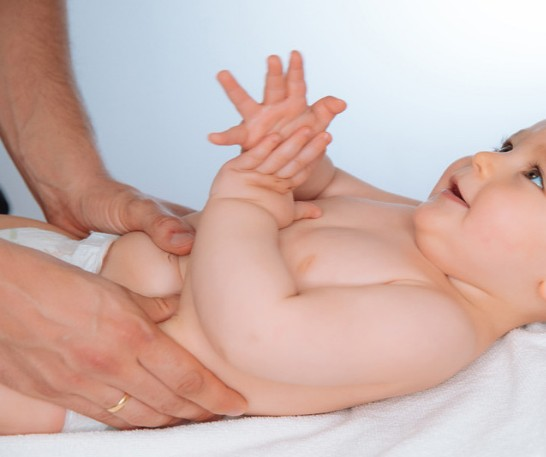

- 활동 유형: 각성 전환 · 시각-청각-촉각 연결 · 상호작용 시작 루틴
- 연결 반사: 탐색반사(Rooting), 모로반사(Moro) 간접 관찰

**이렇게 해보세요!**
권장 시간: 15~25초, 1~2세트

1. 먼저 보호자 얼굴을 가까이 보여준다. (2~3초)
2. 아주 짧게 같은 문장을 말한다. (1문장)
3. 그다음 가슴이나 배 위에 손을 올려 접촉을 준다. (2~3초)
4. 반응을 보고 마무리하거나 한 번 더 반복한다.

**관찰 포인트**
- 얼굴, 목소리, 손 접촉 중 무엇에 가장 잘 반응하는지
- 어느 단계에서 몸이 더 편안해지는지
- 세 단계 모두 하기 전에 이미 피로 신호가 나오는지
- 깨어 있음이 유지되는지, 갑자기 짜증이 올라오는지

**왜 이 활동을 하나요?**

2~3주는 0-1주보다 깨어 있는 시간이 아주 조금 길어질 수 있는 시기다. 하지만 여전히 긴 활동은 어렵고, 짧은 감각 경험을 차례대로 연결해 주는 것이 적절하다.
이 활동은 얼굴-목소리-손 접촉을 순서대로 이어 주며, 아기가 **지금 깨어 있는지, 어떤 감각에 더 잘 반응하는지, 어느 지점에서 피곤해지는지**를 자연스럽게 살피기 위한 활동이다.

**기대 효과**
- 보호자와의 짧은 상호작용 순서를 경험하는 데 도움이 된다.
- 아기의 선호 자극을 파악하는 데 유용하다.
- 수유 후, 기저귀 갈기 후, 낮잠 전 짧은 루틴으로 활용 가능하다.
- 아기의 깨어 있는 질을 관찰하기 좋다.

**주의**
- 단계 수를 늘리지 않는다.
- 한 번에 여러 문장을 계속 말하지 않는다.
- 손 접촉을 누르듯 하지 않는다.
  반응이 약하다고 반복 횟수를 늘리지 않는다.

**활용 TIP**
- 매번 같은 순서를 유지하면 더 익숙한 루틴이 된다.
- 얼굴 반응이 좋은 아기는 얼굴 시간을 조금 더, 손 접촉이 좋은 아기는 마지막 접촉을 조금 더 길게 해도 좋다.
- 피곤한 날엔 한 세트만 하고 끝낸다.

**필요 교구 / 준비물**
- **특별한 교구 없음**
- **조용한 공간**
- **보호자의 목소리와 손**

**대체 / DIY**
- 손 접촉 대신 가제수건을 배 위에 살짝 덮는 방식으로 변형 가능
- 얼굴 대신 가까운 위치의 밝은 천을 먼저 보여준 뒤 얼굴로 이어도 된다.

**사용 TIP**
- 아기가 편안한 단계에서 끝내는 것이 가장 중요하다.
- "반응이 적다"는 실패가 아니라 그날의 컨디션 정보다.

> 추천 교구: 신생아 가제손수건

---

#### 활동 2. 미니 시선 산책

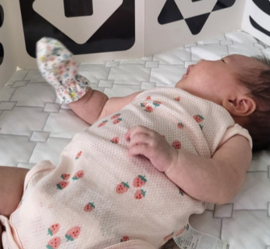

- 활동 유형: 짧은 시선 이동 · 초기 주의 전환 · 시각 탐색 놀이
- 연결 반사: 시각적 주의 반응, 탐색반사(Rooting) 간접 관찰

**이렇게 해보세요!**
권장 시간: 10~20초, 1~2회

1. 보호자 얼굴을 한쪽에서 보여준다.
2. 얼굴을 아주 천천히 반대쪽으로 조금 이동한다.
3. 또는 얼굴 → 밝은 천 → 다시 얼굴 순서로 보여준다.
4. 한 번의 이동만 해도 충분하며, 반응이 좋으면 한 번 더 한다.

**관찰 포인트**
- 시선이 시작 지점에 잠깐 머무는지
- 중간쯤이라도 따라오려는 움직임이 있는지
- 끝까지 따라오지 않아도 방향 전환 시도가 있는지
- 너무 빨리 피로해지는지
- 좌우 중 더 잘 보는 쪽이 있는지

**왜 이 활동을 하나요?**

2-3주의 아기는 아직 시각 추적을 길게 하긴 어렵지만, 가까운 거리에서 한 지점에서 다른 지점으로 시선이 잠깐 옮겨가는 경험은 가능할 수 있다. 이 활동은 추적 훈련처럼 끝까지 보게 만드는 것이 아니라, 짧고 무리 없는 범위에서 시선 이동의 시작을 경험하게 하기 위한 것이다.

**기대 효과**
- 짧은 시선 이동 경험을 자연스럽게 만들 수 있다.
- 얼굴과 대비 자극 사이의 반응 차이를 살피기 좋다.
- 아기의 시각 피로도와 반응 시간을 관찰할 수 있다.
- 무리 없는 초기 주의 놀이로 활용할 수 있다.

**주의**
- 빠르게 흔들지 않는다.
- 장난감 여러 개를 번갈아 쓰지 않는다.
- 끝까지 따라오게 하려는 목표를 두지 않는다.
- 눈을 크게 뜬다고 무조건 좋은 상태는 아니므로 표정과 몸 상태를 함께 본다.

**활용 TIP**
- 아침이나 낮, 조도가 안정적인 시간대에 더 잘 보일 수 있다.
- 배경이 복잡하지 않은 곳에서 진행한다.
- 왼쪽/오른쪽 반응 차이가 있으면 기록해두면 좋다.

**필요 교구 / 준비물**
- **보호자 얼굴**
- **밝은 천 또는 작은 흰 손수건 1개**

**대체 / DIY**
- 별도 시각 카드 없이 가능
- 흰 양말, 흰 거즈 손수건, 흰 종이도 사용 가능
- 검정 무늬가 적은 천도 대비용으로 활용 가능

**사용 TIP**
- 10초 내외 짧게 끝나는 것이 가장 좋다.
- 반응이 조금만 보여도 성공으로 본다.

> 추천 교구(활동2): 신생아 가제손수건

---

#### 활동 3. 어깨-등-골반 파도안기

- 활동 유형: 신체 지지 경험 · 자세 안정 · 전신 이완 안기 루틴
- 연결 반사: 모로반사(Moro), 긴장 반응 관찰

**이렇게 해보세요!**
권장 시간: 20~30초

1. 아기를 안은 상태에서 먼저 어깨와 목 쪽을 안정적으로 받쳐 준다.
2. 그다음 등을 더 밀착되게 지지한다.
3. 마지막으로 골반과 엉덩이 쪽을 더 안정감 있게 받친다.
4. 실제로 흔들기보다, 지지되는 중심이 바뀌는 느낌만 아주 작게 준다.
5. 반응을 보고 종료한다.

**관찰 포인트**
- 어깨 지지 때 긴장이 줄어드는지
- 등이 밀착될 때 숨 쉬는 모습이나 표정이 달라지는지
- 골반 지지 후 다리 힘이 조금 풀리는지
- 특정 지점에서 더 편안해하는지
- 한 지지점에서는 불편해하는지

**왜 이 활동을 하나요?**

아기는 안길 때 몸 전체가 한 번에 편안해지기도 하지만, 실제로는 **어깨, 등, 골반** 중 어느 부위가 더 잘 지지될 때 안정되는지 차이가 있을 수 있다. 이 활동은 흔들기보다 **지지점을 순서대로 느끼게 하는** 안기 활동으로, 몸의 어느 부분에서 안정 반응이 더 잘 나타나는지 살피는 데 의미가 있다.

**기대 효과**
- 보호자가 아기의 안정 포인트를 더 잘 알게 된다.
- 무작정 흔들지 않고도 편안한 안기 방식을 찾는 데 도움이 된다.
- 수유 후 진정, 잠 전 짧은 안정 루틴으로 활용 가능하다.
- 몸 전체의 긴장 분포를 관찰하기 좋다.

**주의**
- 흔들기 활동으로 변하지 않게 한다.
- 목 지지가 불안정하면 안 된다.
- 세게 쓸어내리거나 누르지 않는다.
- 불편해하는 자세를 억지로 유지하지 않는다.

**활용 TIP**
- 낮에는 안기 루틴으로, 밤에는 잠 전 진정 루틴으로 활용 가능하다.
- 보호자마다 안는 방식이 다르면 아기 반응도 달라질 수 있어 비교 관찰이 가능하다.
- 수유 후 바로보다 트림 후 차분해졌을 때 더 적합하다.

**필요 교구 / 준비물**
- **특별한 교구 없음**
- **보호자가 편하게 앉을 의자**
- **필요 시 수유쿠션 또는 팔 받침 쿠션**

**대체 / DIY**
- 일반 쿠션, 베개, 무릎 위 받침으로 보호자 팔 부담을 줄일 수 있다.
- 수건을 말아 팔 아래 받치면 더 안정적이다.

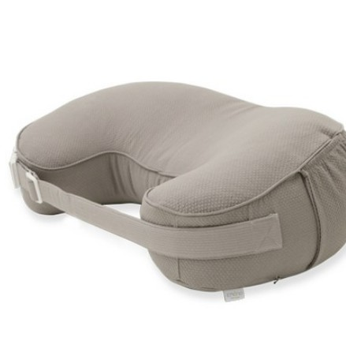

**사용 TIP**
- 파도처럼 크지 않게, 아주 미세한 중심 이동만 주는 것이 핵심이다.
- 아기가 편안해하는 지지 순서를 찾아 루틴화하면 좋다.

> 추천 교구: 신생아 수유쿠션

---

#### 활동 4. 가슴언덕 탐험

- 활동 유형: 관계 중심 자세 경험 · 짧은 엎드림 대체 · 상체 힘 관찰
- 연결 반사: 모로반사(Moro), 탐색반사(Rooting), 자세 반응 관찰

**이렇게 해보세요!**
권장 시간: 10~20초, 1~2회

1. 보호자가 반쯤 기대어 앉는다.
2. 아기를 보호자 가슴 위에 엎드린 자세로 짧게 올린다.
3. 얼굴을 가까이 두고 짧게 말을 하거나 조용히 바라본다.
4. 아기가 불편해하기 전에 바로 마무리한다.

**관찰 포인트**
- 얼굴을 잠깐이라도 들어 보려는지
- 팔, 어깨, 다리에 짧게 힘이 들어가는지
- 보호자 얼굴/목소리에 반응하는지
- 답답해하기 전 유지 가능한 시간이 어느 정도인지
- 끝난 뒤 더 안정되는지, 피곤해하는지

**왜 이 활동을 하나요?**

2-3주 무렵에는 아주 짧게라도 상체를 들어 보려는 작은 시도가 보일 수 있다. 하지만 바닥에서의 엎드림을 길게 하기보다는, 보호자 가슴 위처럼 체온, 냄새, 목소리, 얼굴이 함께 있는 안정된 경사 환경에서 더 편안하게 시도할 수 있다.
이 활동은 고개 들기 성공이 목표가 아니라, 보호자 몸 위에서 **짧은 자세 경험과 관계 중심 탐색**을 해보는 데 의미가 있다.

**기대 효과**
- 바닥보다 정서적으로 안정된 자세 경험이 가능하다.
- 아주 짧은 상체 힘 사용을 관찰할 수 있다.
- 보호자와의 눈맞춤, 냄새, 체온을 함께 경험할 수 있다.
- tummy time의 부담을 줄인 대안으로 활용하기 좋다.

**주의**
- 수유 직후 바로 하지 않는다.
- 성공적으로 고개를 들게 하려는 목표를 두지 않는다.
- 힘들어하기 시작하면 즉시 종료한다.
- 미끄러지지 않도록 보호자 손으로 몸통을 안정적으로 받친다.

**활용 TIP**
- 낮잠 전보다 낮잠 후, 잠깐 깨어 있을 때가 더 적합하다.
- 보호자 목소리를 너무 많이 넣기보다 얼굴과 체온을 함께 느끼게 하는 것이 좋다.
- 10초만 해도 충분하며, 잘했다고 더 오래 하지 않는다.

**필요 교구 / 준비물**
- **등을 기대고 앉을 수 있는 소파, 침대 헤드, 등받이 의자**
- **필요 시 수유쿠션**
- **가슴 위에 댈 얇은 면천**

**대체 / DIY**
- 보호자 다리 위 경사 자세로도 변형 가능
- 수유쿠션 위에 보호자 손을 함께 두고 짧게 시도 가능
- 얇은 수건을 가슴 위에 깔아 땀이나 미끄러움을 줄일 수 있다.

**사용 TIP**
- 이 활동은 운동 훈련이 아니라 "편안한 언덕 경험"으로 설명하는 것이 좋다.
- 성공보다 종료 타이밍이 더 중요하다.

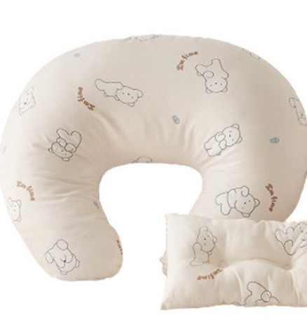

> 추천 교구: 신생아 수유쿠션

---

#### 활동 5. 발바닥 문답놀이

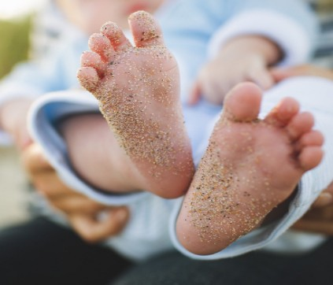

- 활동 유형: 촉각-청각 연결 · 하지 반응 관찰 · 짧은 리듬 놀이
- 연결 반사: 파악반사(Palmar) 간접 관찰, 발바닥 촉각 반응 관찰

**이렇게 해보세요!**
권장 시간: 양쪽 합쳐 15~25초

1. 한쪽 발바닥을 손가락으로 아주 짧게 톡 건드린다.
2. 바로 멈추고 반응을 본다.
3. "여기 있네", "발이 있네"처럼 짧게 말한다.
4. 반대쪽 발도 같은 방식으로 진행한다.
5. 괜찮으면 한 번 더 반복한다.

**관찰 포인트**
- 발가락이 오므라드는지, 펴지는지
- 다리가 살짝 움직이는지
- 한쪽과 다른 쪽 반응 차이가 있는지
- 촉각 뒤 표정이나 몸 긴장이 달라지는지
- 너무 예민해하는지, 괜찮아하는지

**왜 이 활동을 하나요?**

발바닥은 신생아가 비교적 잘 반응하는 부위 중 하나다. 이 활동은 발바닥을 단순히 만지거나 마사지하는 것이 아니라, **짧은 접촉-멈춤-말 걸기-다시 접촉**의 구조를 만들어 아기가 촉각 뒤에 어떤 반응을 보이는지 관찰하기 위한 활동이다.
즉, 자극을 많이 주는 활동이 아니라 **질문하듯 건드리고 기다리는** 활동이다.

**기대 효과**
- 짧은 촉각 입력에 대한 하지 반응을 관찰할 수 있다.
- 좌우 차이를 가볍게 살피기 좋다.
- 몸 전체보다 국소 부위부터 반응을 보는 데 적합하다.
- 보호자와의 짧은 리듬 놀이로 활용 가능하다.

**주의**
- 세게 누르지 않는다.
- 계속 반복해 간지럽히지 않는다.
- 발이 차갑거나 아기가 몸 전체로 예민하면 피한다.
  발을 억지로 펴거나 잡아당기지 않는다.

**활용 TIP**
- 기저귀 갈기 전후, 목욕 후, 옷 갈아입기 전 짧게 하기 좋다.
- 한쪽씩 비교해보는 기록 활동으로도 좋다.
- 목소리를 크게 넣기보다 짧고 동일한 말이 더 적합하다.

**필요 교구 / 준비물**
- **특별한 교구 없음**
- **보호자의 따뜻한 손**
- **필요 시 얇은 면수건**

**대체 / DIY**
- 발바닥 대신 발등/발목 가벼운 감싸기로 변형 가능
- 면수건을 잠깐 덮었다 치우는 촉감 변형도 가능

**사용 TIP**
- 한 번 접촉 후 멈추는 구간이 핵심이다.
- 반응이 약해도 괜찮으며, 억지로 반응을 끌어내지 않는다.

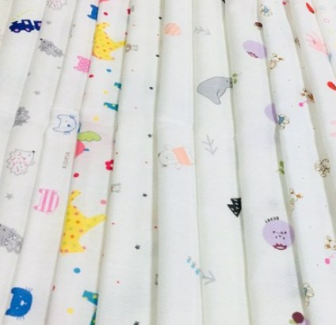

> 추천 교구(활동5): 신생아 가제손수건

---

### 부록 2. 2-3주 활동 후 자연 반응 관찰표

#### 1. 이 관찰표는 어떻게 보나요?

이 표는 반사를 유도하거나 검사하기 위한 표가 아닙니다.
2-3주 아기와 짧은 활동을 한 뒤, 활동 후 아기의 **전체 상태 변화, 짧은 상호작용 반응**, 그리고 함께 보일 수 있는 **자연스러운 반응**을 차분히 기록하기 위한 관찰표입니다.

2-3주는 0-1주보다 깨어 있는 시간이 아주 조금 길어질 수 있고, 얼굴·목소리·손 접촉 같은 짧은 상호작용에 반응이 보이기도 합니다. 하지만 여전히 많은 자극을 오래 주는 시기가 아니므로, 이 표 역시 "무엇을 더 시켜야 하는가"보다 **오늘 아기에게 어떤 방식이 편안했는지, 어떤 활동에서 피로 신호가 나왔는지**를 보기 위해 사용합니다.

**이렇게 활용하세요.**

- 활동 직후 1분 안에 아주 짧게 기록합니다.
- 먼저 전체 상태를 보고,
- 그다음 함께 볼 수 있는 자연 반응을 확인합니다.
- 하루에 모든 활동을 다 기록할 필요는 없습니다.
- 그날 했던 활동 중 1~2개만 기록해도 충분합니다.
- 2-3주는 반사만 따로 보기보다, 시선 머무름, 얼굴·목소리 반응, 자세 후 편안함도 함께 봅니다.

---

#### 2. 먼저, 오늘 어떤 활동을 했나요?

**오늘 진행한 활동**

- □ 활동 1. 깨어남 신호 릴레이
- □ 활동 2. 미니 시선 산책
- □ 활동 3. 어깨-등-골반 파도안기
- □ 활동 4. 가슴언덕 탐험
- □ 활동 5. 발바닥 문답놀이

**기록 날짜**

날짜: ________
시간: ________
활동 전 상태: □ 잠들기 전 □ 수유 후 □ 기저귀 교체 후 □ 깨어 있는 조용한 시간 □ 트림 후 □ 기타 ________

---

#### 3. 1단계: 활동 직후 아기의 전체 상태를 먼저 봅니다.

**2-3주 활동 직후 전체 상태 관찰표**

| 관찰 항목 | 예 | 보통 | 아니오 |
|---|---|---|---|
| 활동 후 몸이 조금 더 편안해 보였어요. | □ | □ | □ |
| 얼굴 표정이 조금 더 부드러워졌어요. | □ | □ | □ |
| 울음이나 찡그림이 줄어들었어요. | □ | □ | □ |
| 팔·다리·어깨의 긴장이 조금 풀린 것 같아요. | □ | □ | □ |
| 얼굴을 돌리거나 피하려는 신호가 보였어요. | □ | □ | □ |
| 활동 후 너무 피곤해 보였어요. | □ | □ | □ |
| 활동 직후 잠깐이라도 깨어 있는 반응이 유지되었어요. | □ | □ | □ |
| 안았을 때 또는 손을 얹었을 때 차분해지는 모습이 있었어요. | □ | □ | □ |

**1단계 기록 시 보는 기준**
- **예:** 비교적 분명하게 보였을 때
- **보통:** 잘 모르겠거나 짧게 보였을 때
- **아니오:** 거의 보이지 않았을 때

**1단계 해석 도움말**
- "편안해 보였어요", "표정이 부드러워졌어요", "깨어 있는 반응이 유지되었어요"에 예가 많으면
  → 오늘 활동이 비교적 무리 없었을 가능성이 있습니다.
- "피하려는 신호", "너무 피곤해 보였어요"에 예가 많으면
  → 다음에는 시간을 더 줄이거나, 한 번에 하는 활동 수를 줄이는 것이 좋습니다.

---

#### 4. 2단계: 함께 볼 수 있는 자연 반응을 확인합니다.

아래 항목은 활동 후 함께 볼 수 있는 반응을 정리한 것입니다.
2-3주는 0-1주보다 반응이 약간 다양해질 수 있으므로, 반사뿐 아니라 **시선, 얼굴·목소리 반응, 자세 후 편안함**도 함께 봅니다.

**2-3주 자연 반응 관찰표**

| 보이는 모습(부모가 보는 표현) | 관련 반사/반응 | 뚜렷함 | 약하게 보임 | 잘 안보임 |
|---|---|---|---|---|
| 깜짝 놀라며 팔이 벌어지는 모습이 있었어요. | 모로반사(Moro) | □ | □ | □ |
| 입 주변 자극에 얼굴이나 입이 반응했어요. | 탐색반사(Rooting) | □ | □ | □ |
| 손바닥 자극에 손을 쥐는 모습이 있었어요. | 파악반사(Palmar) | □ | □ | □ |
| 얼굴이나 밝은 물체 쪽으로 시선이 잠깐 머물렀어요. | 시각적 주의 반응 | □ | □ | □ |
| 목소리 뒤에 표정, 입, 몸 움직임이 잠깐 달라졌어요. | 청각-사회적 반응 | □ | □ | □ |
| 안기거나 자세를 바꾼 뒤 몸이 조금 더 안정되는 모습이 있었어요. | 자세 후 안정 반응 | □ | □ | □ |
| 발이나 다리 자극 뒤 다리 움직임이 있었어요. | 하지 반응 관찰 | □ | □ | □ |

**2단계 체크 기준**
- **뚜렷함:** 비교적 분명하게 관찰됨
- **약하게 보임:** 약하거나 짧게 보임
- **잘 안 보임:** 오늘은 거의 보이지 않음

**2단계 사용할 때 중요한 점**
- 2-3주에도 반응은 수면, 수유, 피로, 각성 상태에 따라 크게 달라질 수 있습니다.
- "잘 안 보임"은 바로 문제를 뜻하지 않습니다.
- 한 번의 반응보다 반복되는 흐름을 보는 것이 더 중요합니다.
- 시선 머무름이나 목소리 반응도 "잠깐" 보이면 충분합니다.

---

#### 5. 오늘 기록 메모

오늘 가장 편안해한 활동

________________________________________

오늘 조금 부담스러워한 활동

________________________________________

활동 후 특히 눈에 띄었던 반응

________________________________________

시선·표정·목소리 반응에서 눈에 띈 점

________________________________________

**다음에는 어떻게 조정하면 좋을까요?**

- □ 시간을 더 짧게 해본다
- □ 활동 횟수를 줄여본다
- □ 더 조용한 시간에 해본다
- □ 수유/잠 루틴과 연결해본다
- □ 같은 활동을 한 번 더 관찰해본다
- □ 얼굴·목소리 반응을 먼저 본다
- □ 기타: ________________

---

#### 6. 간단 해석 가이드

**이런 경우는 비교적 무리 없는 흐름일 수 있어요**
- 활동 후 몸이 더 편안해 보임
- 표정이 부드러워짐
- 짧게라도 얼굴, 목소리, 손 접촉에 반응함
- 자세를 바꾼 뒤 더 안정되는 모습이 있음
- 반응이 뚜렷하지 않아도 전반적으로 편안해 보임

**이런 경우는 다음에 더 짧게 조정해보세요**
- 얼굴을 돌리거나 자꾸 피함
- 활동 후 더 예민해짐
- 몸이 뻣뻣해지거나 울음이 커짐
- 시선 놀이, 자세 놀이 뒤 너무 피곤해 보임
- 안기거나 접촉할 때 몸이 더 뻣뻣해짐

**이런 경우는 며칠 기록을 이어서 보세요**
- 어떤 날은 잘 반응하고 어떤 날은 거의 반응하지 않음
- 한쪽으로만 시선이 가거나 몸 반응 차이가 있음
- 수유 전후에 반응 차이가 큼

**이런 경우는 상담을 고려해 보세요**
- 며칠 동안 반복해서 전반 반응이 매우 약함
- 얼굴·목소리·접촉에 대한 반응이 거의 보이지 않는 상태가 계속됨
- 안아도 진정이 거의 되지 않는 상태가 지속됨
- 수유, 잠, 울음 회복이 유난히 어렵고 반복됨
- 보호자가 "평소와 다르게 이상하다"고 계속 느끼는 변화가 있음 *(2-3주 해석 가이드)*

---

### 2-4. 부모 관찰 기록용 체크리스트

#### 2-3주에서 봐야 할 6개 체크 영역부터 알고가기!

**① 신체·성장**
몸의 기본 자세와 근긴장, 전반적인 활력, 성장과 체중 변화 흐름을 봅니다.
출생 체중 회복과 소화 적응 과정에서 나타나는 신호도 함께 관찰합니다.

**② 감각·지각**
빛·소리·촉감 같은 자극에 너무 과하지도, 너무 약하지도 않게 반응하는지 확인합니다.
깨어 있는 시간이 늘어 과자극 신호가 더 잘 보일 수 있습니다.

**③ 인지·주의**
짧은 순간이라도 얼굴이나 빛에 주의가 머무르는지, 자극에 대한 조절이 되는지 봅니다.
같은 자극에서도 점차 안정되는 흐름이 나타나는지 관찰합니다.

**④ 언어·의사소통**
울음으로 욕구를 표현하고, 보호자 목소리에 반응하는 초기 소통 신호를 봅니다.
울음의 느낌이 상황에 따라 조금씩 구분되기 시작할 수 있습니다.

**⑤ 정서·사회**
안아주기나 접촉에 진정되는지, 표정이 부드러워지는지 등 안정감 신호를 봅니다.
저녁 시간대 예민함이 생기면 안정 루틴의 반복이 더 중요해집니다.

**⑥ 조절·수면·생리**
잠과 깸의 전환, 수유 후 진정, 호흡과 피부색 같은 기본 생리 안정 신호를 확인합니다.
깨어 있는 시간이 늘어 과피로가 쌓이지 않도록 돕는 것이 핵심입니다.

---

#### 점수 기준 (2-3주)

| 점수 | 기준 |
|---|---|
| 4 | 하루 동안 자주 안정적으로 보였다 |
| 3 | 하루 동안 여러 번 보였다 |
| 2 | 가끔 보였다 |
| 1 | 드물게 보였다 |
| 0 | 오늘은 거의 보이지 않았다 |

> 관찰 기준: "지난 24시간(또는 오늘 하루) 동안 깨어 있는 시간에 '대표적으로 보인 빈도"

> 기록 TIP: "잠든 상태는 제외하고, 깨어 있는 짧은 시간(수유 전·후/기저귀 교체/목욕 후)과 저녁 예민 시간대 반응을 중심으로 관찰하세요."

#### ① 신체·성장 (2-3주)

| 관찰 항목 | 4 | 3 | 2 | 1 | 0 | 메모 |
|---|---|---|---|---|---|---|
| Q1-1. 수유 후 너무 지치지 않고, 먹고 난 뒤 전반적으로 조금 더 안정되는 흐름이 있다. | □ | □ | □ | □ | □ | |
| Q1-2. 깨어 있는 짧은 시간에 팔다리를 스스로 움직이는 모습이 자연스럽게 보인다. | □ | □ | □ | □ | □ | |
| Q1-3. 몸이 지나치게 축 늘어지지 않고, 한쪽으로만 심하게 치우치는 모습이 반복되지는 않는다. | □ | □ | □ | □ | □ | |

#### ② 감각·지각 (2-3주)

| 관찰 항목 | 4 | 3 | 2 | 1 | 0 | 메모 |
|---|---|---|---|---|---|---|
| Q2-1. 20~30cm 거리에서 보호자 얼굴을 잠깐이라도 바라보는 순간이 있다. | □ | □ | □ | □ | □ | |
| Q2-2. 갑작스러운 소리나 자세 변화에 놀라도, 안아주거나 기다리면 비교적 다시 가라앉는 편이다. | □ | □ | □ | □ | □ | |
| Q2-3. 부드러운 접촉이나 쓰다듬기 뒤 몸이 이완되거나 편안해지는 반응이 있다. | □ | □ | □ | □ | □ | |

#### ③ 인지·주의 (2-3주)

| 관찰 항목 | 4 | 3 | 2 | 1 | 0 | 메모 |
|---|---|---|---|---|---|---|
| Q3-1. 깨어 있을 때 얼굴이나 빛 쪽에 1~2초라도 주의가 머무는 순간이 있다. | □ | □ | □ | □ | □ | |
| Q3-2. 비슷한 자극이 반복될 때, 처음보다 덜 놀라거나 점차 안정되는 모습이 있다. | □ | □ | □ | □ | □ | |
| Q3-3. 짧은 활동 뒤 고개 돌림, 하품, 찡그림 같은 쉬고 싶다는 신호가 잠시 보이더라도, 비교적 다시 안정되는 편이다. | □ | □ | □ | □ | □ | |

#### ④ 언어·의사소통 (2-3주)

| 관찰 항목 | 4 | 3 | 2 | 1 | 0 | 메모 |
|---|---|---|---|---|---|---|
| Q4-1. 배고픔, 졸림, 불편함에 따라 울음이나 몸짓이 조금 다르게 느껴지는 순간이 있다. | □ | □ | □ | □ | □ | |
| Q4-2. 보호자 목소리가 들리면 울음을 잠깐 멈추거나 표정·몸 움직임이 달라진다. | □ | □ | □ | □ | □ | |
| Q4-3. 가까이에서 말을 걸면 시선, 표정, 몸 움직임에 잠깐 변화가 나타난다. | □ | □ | □ | □ | □ | |

#### ⑤ 정서·사회 (2-3주)

| 관찰 항목 | 4 | 3 | 2 | 1 | 0 | 메모 |
|---|---|---|---|---|---|---|
| Q5-1. 안아주기나 피부 접촉을 하면 몸이 이완되거나 진정되는 모습이 있다. | □ | □ | □ | □ | □ | |
| Q5-2. 예민해지는 시간이 있어도, 익숙한 안기기·목소리·터치 같은 안정 루틴 뒤 진정되는 시간이 생긴다. | □ | □ | □ | □ | □ | |
| Q5-3. 눈을 마주칠 때 표정이 부드러워지는 순간이 있다. | □ | □ | □ | □ | □ | |

#### ⑥ 조절·수면·생리 (2-3주)

| 관찰 항목 | 4 | 3 | 2 | 1 | 0 | 메모 |
|---|---|---|---|---|---|---|
| Q6-1. 하품, 멍한 표정, 보채기 같은 졸림 신호가 보일 때 과하게 각성되지 않고 비교적 잠으로 전환되는 편이다. | □ | □ | □ | □ | □ | |
| Q6-2. 수유 후 비교적 빠르게 진정되거나 잠드는 편이다. | □ | □ | □ | □ | □ | |
| Q6-3. 울음 뒤 안아주거나 돌봐주면 다시 가라앉는 순간이 있다. | □ | □ | □ | □ | □ | |

---

#### 점수 해석 가이드 (2-3주)

**퍼센트 = (획득 점수 / 72) x 100** → 오늘 관찰 기록을 이해하기 위한 참고값입니다.

| 퍼센트 | 해석 | 부모 솔루션 |
|---|---|---|
| 85~100% | 현재 관찰상 매우 안정적인 편 | 기본 루틴 유지 / 과한 자극 피하기. 하루 1~2개 짧은 활동(1~3분)만 유지하고, 같은 항상 안정 터치로 마무리. |
| 70~84% | 대체로 무난한 편 | 현재 루틴 유지 / 기록 지속. 저녁 예민 시간대에는 새 활동 추가보다 안정 루틴 반복. |
| 55~69% | 조금 더 관찰이 필요한 편 | 활동 수 줄이기 / 안정 우선. 하루 1개만, 시간 줄이기. 수유 전·후/기저귀 후 짧게 관찰. 가스/트림 불편이 있으면 소화 루틴을 먼저. |
| 40~54% | 루틴 조정 및 재확인 권장 | 과자극 줄이기 / 진정 루틴 고정. 과자극 신호(고개 돌림·하품·찡그림·울음 커짐)가 잦으면 빛/소리/움직임 최소화. 저녁 루틴을 고정하고 지속 시 상담 고려. |
| 0~39% | 추가 관찰 및 상담 고려 | 추가 관찰 / 전문가 상담 고려. 한쪽 반응만 지속, 먹기/잠/호흡 등 기본 기능이 불안정하거나 보호자 걱정이 크면 빠르게 상담/평가 권장. |

\* 본 관찰표는 표준화 검사가 아닌 부모 관찰 기록용 구조입니다.

> 점수 입력 후, 앱에서 결과와 영역별 요약을 확인하세요. 해당 구간의 부모 솔루션을 체크하며 오늘 루틴을 조정해 보세요.

---

#### 위험 신호 (추가 관찰 필요 / 전문가 상담 고려) — 2-3주

| 항목 | 체크 | 메모 |
|---|---|---|
| 전반 반응 저하: 시선·소리·촉감·움직임 반응이 갑자기 줄어듦 | □ | |
| 한쪽 치우침 지속: 몸이나 머리가 한쪽으로만 계속 기울거나 치우침 | □ | |
| 먹기/잠/울음 회복 어려움: 진정이 거의 되지 않음 | □ | |
| 호흡이 평소보다 힘들어 보이거나 불규칙함이 반복됨 | □ | |
| 입술/피부색이 평소와 다르게 창백하거나 퍼렇게 보임 | □ | |
| 보호자 직감: "뭔가 이상하다" 느낌이 강함 | □ | |

\* 권고 문구: 위 양상이 반복되거나 2~3일 이상 지속되거나, 보호자 걱정이 크면 전문가 상담/추가 관찰을 고려합니다. (2-3주)

---

### 부록 2. 각 문항 출처 도구 (비공개) — 2-3주

#### ① 신체·성장

Q1-1 수유 후 너무 지치지 않고, 먹고 난 뒤 전반적으로 조금 더 안정되는 흐름이 있다.
참고 도구: K-DST, ASQ-3, NBAS, WHO Growth Standards

Q1-2 깨어 있는 짧은 시간에 팔다리를 스스로 움직이는 모습이 자연스럽게 보인다.
참고 도구: NBAS, Bayley-4, AIMS

Q1-3 몸이 지나치게 축 늘어지지 않고, 한쪽으로만 심하게 치우치는 모습이 반복되지는 않는다.
참고 도구: NBAS, Bayley-4, K-DST

#### ② 감각·지각

Q2-1 20~30cm 거리에서 보호자 얼굴을 잠깐이라도 바라보는 순간이 있다.
참고 도구: NBAS(or NBO/NBAS), Bayley-4, ASQ-3

Q2-2 갑작스러운 소리나 자세 변화에 놀라도, 안아주거나 기다리면 비교적 다시 가라앉는 편이다.
참고 도구: NBAS, Bayley-4, K-DST

Q2-3 부드러운 접촉이나 쓰다듬기 뒤 몸이 이완되거나 편안해지는 반응이 있다.
참고 도구: NBAS, Bayley-4, skin-to-skin & co-regulation 연구 프레임

#### ③ 인지·주의

Q3-1 깨어 있을 때 얼굴이나 빛 쪽에 1~2초라도 주의가 머무는 순간이 있다.
참고 도구: NBAS, Bayley-4, ASQ-3

Q3-2 비슷한 자극이 반복될 때, 처음보다 덜 놀라거나 점차 안정되는 모습이 있다.
참고 도구: NBAS, Bayley-4, 신생아 상태조절 프레임

Q3-3 짧은 활동 뒤 고개 돌림, 하품, 찡그림 같은 쉬고 싶다는 신호가 잠시 보이더라도, 비교적 다시 안정되는 편이다.
참고 도구: NBAS, NBO/NBAS 계열 신생아 행동관찰 프레임

#### ④ 언어·의사소통

Q4-1 배고픔, 졸림, 불편함에 따라 울음이나 몸짓이 조금 다르게 느껴지는 순간이 있다.
참고 도구: NBAS, ASQ-3, Bayley-4

Q4-2 보호자 목소리가 들리면 울음을 잠깐 멈추거나 표정·몸 움직임이 달라진다.
참고 도구: NBAS, Bayley-4, ASQ-3

Q4-3 가까이에서 말을 걸면 시선, 표정, 몸 움직임에 잠깐 변화가 나타난다.
참고 도구: NBAS, Bayley-4, 부모-영아 상호작용 프레임

#### ⑤ 정서·사회

Q5-1 안아주기나 피부 접촉을 하면 몸이 이완되거나 진정되는 모습이 있다.
참고 도구: NBAS, Bayley-4, skin-to-skin & co-regulation 프레임

Q5-2 예민해지는 시간이 있어도, 익숙한 안기기·목소리·터치 같은 안정 루틴 뒤 진정되는 시간이 생긴다.
참고 도구: NBAS, 부모-영아 공조절 프레임, ASQ:SE 계열 관점 참고

Q5-3 눈을 마주칠 때 표정이 부드러워지는 순간이 있다.
참고 도구: NBAS, Bayley-4, ASQ-3 personal-social 영역 관점 참고

#### ⑥ 조절·수면·생리

Q6-1 하품, 멍한 표정, 보채기 같은 졸림 신호가 보일 때 과하게 각성되지 않고 비교적 잠으로 전환되는 편이다.
측정 도구: NBAS, Bayley-4, 부모 수면·상태전환 기록 프레임

Q6-2 수유 후 비교적 빠르게 진정되거나 잠드는 편이다.
측정 도구: NBAS, Bayley-4, 부모 일상 루틴 관찰 프레임

Q6-3 울음 뒤 안아주거나 돌봐주면 다시 가라앉는 순간이 있다.
측정 도구: NBAS, 부모-영아 co-regulation 프레임, ASQ류 부모관찰 문항 구조 참고

---

#### 참고 도구 요약표 (2-3주)

| 참고 도구 | 주로 참고한 부분 |
|---|---|
| NBAS | 상태조절, 놀람 반응, orientation, consolability, stress sign, 자발 움직임, 사회적 반응 |
| NBO/NBAS 계열 프레임 | 신생아 행동관찰, 과자극 신호, 쉬고 싶다는 신호, 활동 후 회복 흐름 |
| Bayley-4 | 운동·행동 관찰 틀, 주의·인지 반응 틀, 조기 언어·사회정서 반응 관찰 틀 |
| ASQ-3 | 부모보고형 문항 구조, 의사소통/개인-사회 영역의 관찰식 서술 방식 |
| ASQ:SE 계열 관점 | 정서조절, 진정, 사회적 안정 반응을 부모가 관찰하는 방식 |
| AIMS | 자세, 굴곡 posture, 자발 움직임, 운동 관찰 관점 |
| K-DST | 부모 관찰 기반의 발달 선별 관점, 위험 신호/생활 리듬 관찰 관점 |
| WHO Growth Standards | 성장 자체보다 성장 흐름과 먹는 흐름을 함께 보는 관점 |
| skin-to-skin / co-regulation 프레임 | 안아주기, 피부 접촉, 진정, 이완, 보호자-영아 공조절 |
| 부모-영아 상호작용 프레임 | 목소리, 시선, 표정, 움직임 변화 같은 조기 상호작용 반응 |
| 부모 수면·상태전환 기록 프레임 | 졸림 신호, 각성-수면 전환, 호흡, 깨어나는 패턴 |
| 부모 일상 루틴 관찰 프레임 | 수유 후 진정, 트림 후 안정, 울음 뒤 회복 같은 일상 관찰 흐름 |

